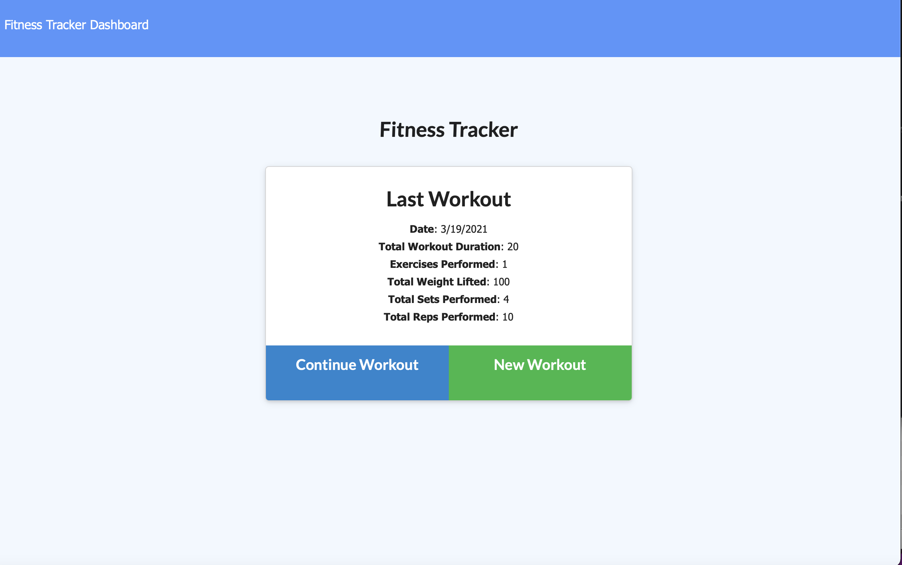
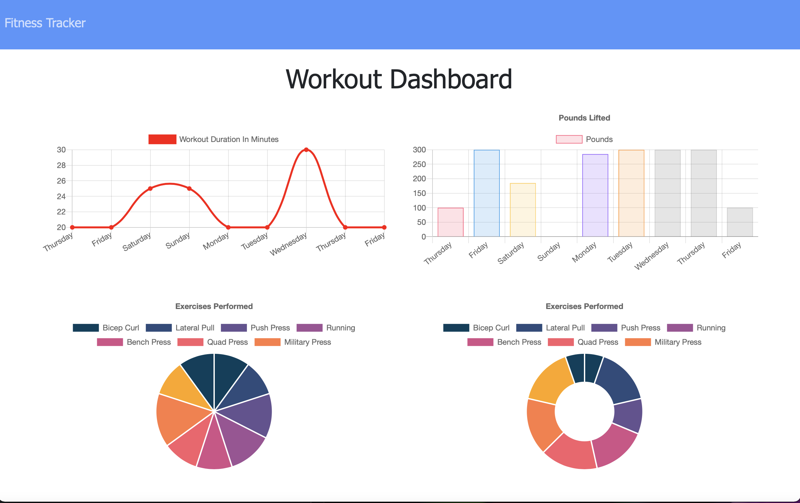

# Workout Tracker
## Description
  Use this Workout Tracker to track your individual exercises for every workout.  The dashboard shows summaries for both duration and pounds lifted.

  [Link to Deployed Application](https://fierce-inlet-78041.herokuapp.com/)
  
  
  
  ## Table of Contents
  * [Installation](#installation)
  * [Languages and Technologies Used](#languages)
  * [Questions](#questions)
  
  ## Installation
 - assuming node and npm are installed. 

```shell
$ git clone git@github.com:sfunk11/fitness-tracker.git
$ cd fitness-tracker/
$ npm i
```
### Deploy to heroku
```shell
$ heroku create
$ git push heroku master
```

  ### Screenshots
  
  


  ## Languages and Technologies Used
  * HTML / CSS
  * Javascript (JQuery)
  * Database: MongoDB (Atlas DB)
  * Deployed to Heroku web service hosting
  * Node.js and packages:
    * Express
    * Mongoose
    * Morgan

  
  ## Questions
  If you have any questions, please send them to me through GitHub or email.

  Github Username: sfunk11

  [borley1@gmail.com](mailto:borley1@gmail.com)

